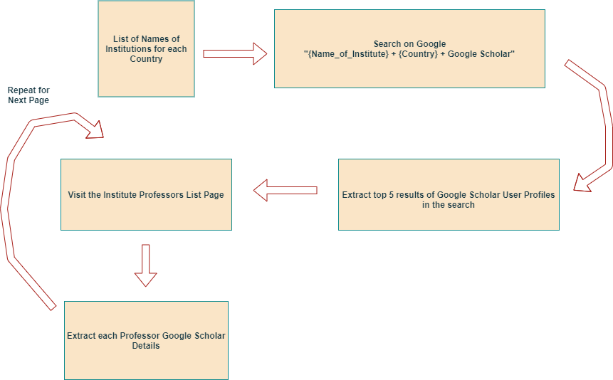
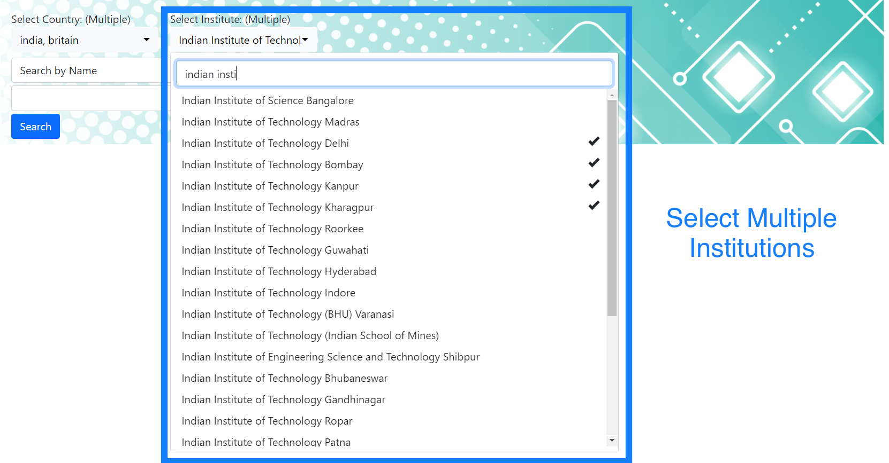
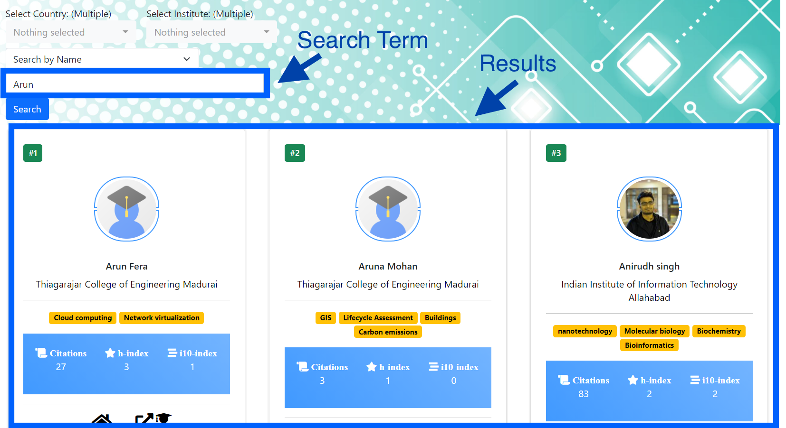
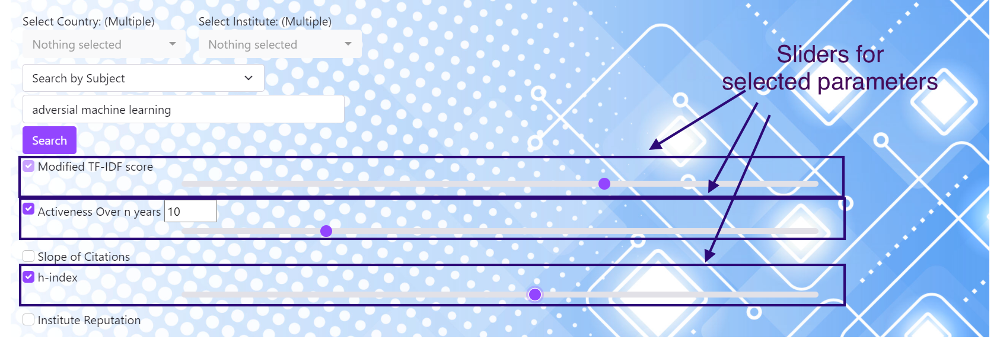
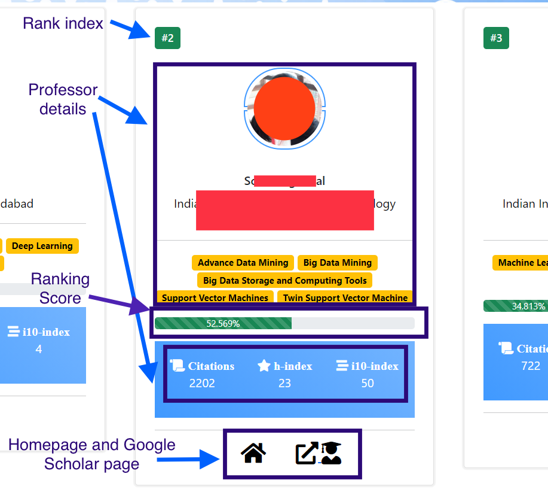

# ProfQuest: Search Engine of Professors

Searching for professors based on certain parameters is a problem faced by students applying for higher studies. We have devised ProfQuest, a search engine which allows users to search professors by subject of interests or specific name with filters of location and institution. A ranking algorithm encompassing factors like activeness in the recent years, growth rate of citations, institute reputation and h-index has been proposed. The user can decide the weightage given to each criteria in ranking as per personal preferences. We modify the traditional TF-IDF method to better adapt to rankings of professors based on the relevance of research papers and domain to the search query.


## Supplementary Resources

* Link to Neurips style research paper detailing our work: [Click_here](https://drive.google.com/file/d/1hWv3e3q3WTYOgk5nTLBwfepjjaenAvKt/view?usp=sharing)

* Link to the slides for final project presentation: [Click_here](https://drive.google.com/file/d/11uuPkDDg4whQCT6tnlHKZgaWrYuM1BlR/view?usp=sharing)

* Link to video explaining the project and showing the webapp demo:
[Click_here](https://drive.google.com/file/d/1G97R1BnBqmIJ0DfKc2zqKCvvkX2EjMQ1/view?usp=sharing)


## File Structure
```bash
├── README.md
├── app.py
├── Search_Engine_Complete_Algorithm.ipynb # File which preprocesses the extracted data and stores it in pickle format for faster querying, also contains code for querying, well commented
├── data
│   ├── input_lists # Contains the input list of institutions from the user for Scraper
│   └── output_data # The scraped Output folders are stored here
├── data_cleaning # Files for extraction  and cleaning of scraped data
│   ├── extract_data.py
├── data_india_sample.jl # Contains a sample of the extracted relevant information from the google scholar pages of the professors
├── scholar_dataset
│   ├── items.py
│   ├── middlewares.py
│   ├── pipelines.py
│   ├── settings.py
│   └── spiders
│       └── scholars_spider.py # The main spider crawler program
├── scrapy.cfg
├── static
│   ├── css
│   │   ├── index.css
│   │   └── search_results.css
│   ├── images
│   └── js
│       └── index.js
├── templates
│   ├── index.html
│   └── search_results.html
├── requirements.txt # Contains names of python packages needed for running code
├── tfidf_model.py # Contains functions which process name and subject queries
└── web_data # Contains pickled files generated after preprocessing dataset
    ├── america_institutes.txt
    ├── britain_institutes.txt
    ├── count_vectorizer.pkl
    ├── countries_list.txt
    ├── doc_id_dict.pkl
    ├── documents.pkl
    ├── india_institutes.txt
    ├── mat_activeness.pkl
    ├── prof_names.pkl
    ├── ranking_metrics.pkl
    └── tfidf_new_matrix.pkl
```


### Requirements:
- scrapy
- jsonlines
- flask
- nltk
- sklearn
- pickle
- scipy
- difflib
- heapq
- numpy


## Scrapoxy Configuration [Optional](Config files in Scrapoxy branch)
### Installation:
```
sudo apt-get install build-essential
sudo npm install -g scrapoxy
pip3 install scrapoxy
```
### Usage:
- Generate "accessKeyId" and "secretAccessKey", from AWS credentials. Replace the values in the `conf.json` file.
- Run 
```bash
scrapoxy start conf.json -d   
```
- The GUI of Scrapoxy is accessible at: `localhost:8889/`. Password is set to "jujutsu" (by default). 
- The region is set to Mumbai in conf.json.
- Currently max instances are set to 3, change as per your AWS credits.


<br>

## Web Crawler
1. Input to the crawler is a list of Institutions in a txt file at location ```data/input_lists/{country_name}```. Here country_name is the name of the country to which the list of the institutions belong.
2. Run ```scrapy crawl scholars -o {output_json_lines}.jl -a country={country}``` from the main working directory. Replace output_json_lines with the desired name for output file.
3. After this step, the scraped HTML files will be stored in ```data/output_data/{country_name}```. The name of the HTML files will be the Google Scholar ID of the profile. The details associated with these HTML files such as Institution, Country are stored in the output file as mentioned in step 2.
<br>



<br>

## Extraction of Scraped Data
1. After running the webcrawler above, the data is still stored in the HTML files.
2. In this section, we extract the data from the HTML files and store the extracted data in json lines format.
3. From the main directory run ```python3 data_cleaning/extract_data.py```. 
4. In the input to the python script, give the name of the country as used in above sections.
5. The final extracted data will be stored at ```oup_{country_name}.jl``` file in the main directory.

### Data Extraction Usage Example:
- Create a txt file as `data/input_lists/britain.txt`.
- Run ```scrapy crawl scholars -o britain_scrap_oup.jl -a country=britain``` from the main working directory. 
- Run ```python3 data_cleaning/extract_data.py``` from main working directory, give the input `britain` to the program.
- The final extracted data stored in `oup_britain.jl` in main directory.
  
## Preprocessing the extracted data for efficient querying
1. Once we have the extracted data in a `.jl` file, it will be preprocessed using the `Search_Engine_Complete_Algorithm.ipynb` jupyter notebook.
2. Replace the name of the `.jl` file present in the notebook with the name of your `.jl` file.
3. Run each cell of the notebook step by step. This will create several `.pkl` files in the `web_data` folder which will be used later for querying. 
4. You may also use the code under sections titled *Subject Query* and *Name Query* for executing subject and name queries in the jupyter notebook itself. 

## Running the web application
1. Once the `.pkl` files are obtained after preprocessing, we are ready to run the web application.
2. Run
```bash
python3 app.py
```
3. The application will be launched on a local host.

## Application Interface

### Search Filters
There are two search filters in the application, by Country and by Institutions. Both are multi-select inputs with search functionality as shown in the figure below.



<br>

### Search by Name
For search by Name, Gestalt Pattern Matching algorithm is used with extension for handling junk. It is implemented in difflib.SequenceMatcher class in Python. There are no search parameters while searching by name, other than the query term and search filters.


<br>

### Search by Subject
In Search By Subject, the user can select search parameters using checboxes. On selecting the parameters, the weights can be assigned to each search parameter using the sliders.



<br>

### Results
In the search results, for each professor, we show the ranking, the weighted score based on the search parameters (out of 100) and details such ashomepage, area of interests, google scholar page, etc.


<br>


### Contributors:
- Dishank Goel (18110052)
- Sachin Yadav (18110148)
- Raghav Goyal (18110135)

